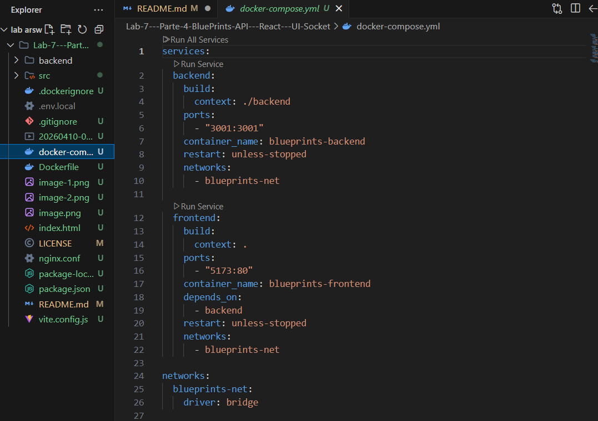
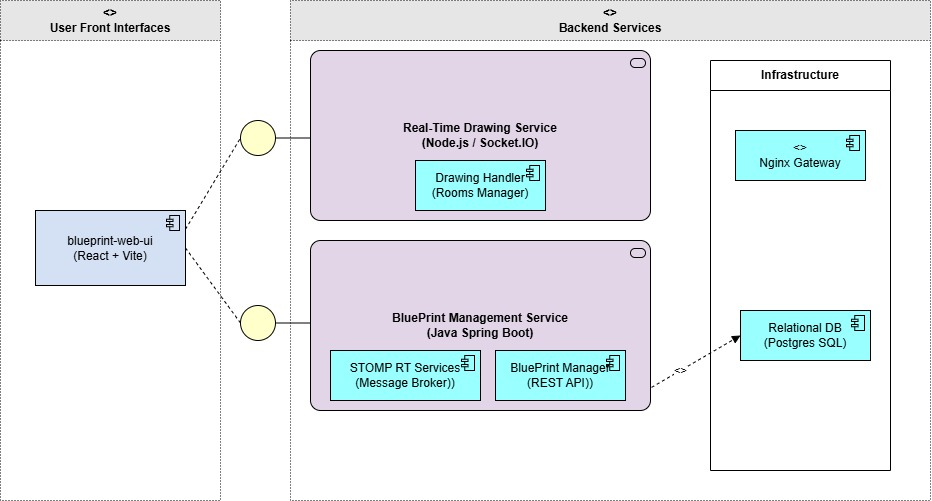
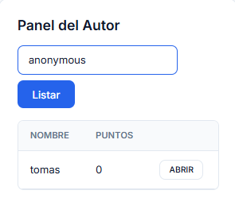
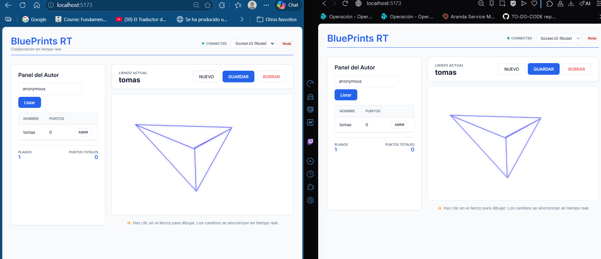
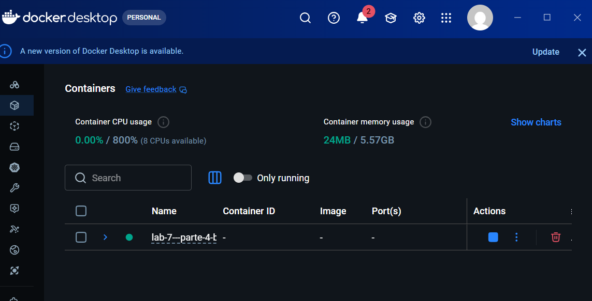

# Laboratorio 4 — BluePrints en Tiempo Real (Sockets & STOMP)

## 👥 Integrantes
<<<<<<< HEAD
*   María Paula Rodríguez Muñoz
*   Juan Andrés Suárez
*   Juan Pablo Nieto
*   Tomás Felipe Ramírez
=======
*   [Nombre del Integrante 1]
*   [Nombre del Integrante 2]
*   [Nombre del Integrante 3]
>>>>>>> 82666d4896b510f6e22b55d375a2a874e28111a3

---

## 🎯 Introducción
En este laboratorio, hemos implementado una solución de colaboración en tiempo real para la gestión y edición de planos (BluePrints). Nuestra aplicación permite que múltiples usuarios visualicen, creen y editen planos simultáneamente, asegurando que cada trazo realizado en un navegador se replique instantáneamente en todos los demás clientes conectados al mismo plano.

Para lograr esto, integramos un frontend moderno en **React** con una arquitectura de backend híbrida que soporta tanto **Socket.IO (Node.js)** como **STOMP (Spring Boot)**.

---

## 🏗️ Arquitectura del Sistema
Hemos diseñado una arquitectura basada en microservicios y contenedores para garantizar la escalabilidad y la facilidad de despliegue.

*   **Frontend**: Desarrollado con React y Vite, desplegado en un contenedor Nginx.
*   **Backend (RT)**: Un servidor Node.js que gestiona las salas (rooms) y el broadcast de eventos de dibujo.
*   **Reverse Proxy (Nginx)**: Actúa como punto de entrada único, redirigiendo el tráfico HTTP y los WebSockets (Socket.IO y STOMP) hacia los servicios correspondientes.

<<<<<<< HEAD


---

## Diagrama de componentes



=======


---

>>>>>>> 82666d4896b510f6e22b55d375a2a874e28111a3
## 🧩 Implementación Técnica

### 1. Gestión CRUD (REST)
Implementamos la integración completa con la API de BluePrints para las operaciones fundamentales:
*   **Listado**: Recuperamos todos los planos de un autor específico.
*   **Consulta**: Obtenemos los puntos de un plano antes de iniciar la sesión de tiempo real.
*   **Persistencia**: Permitimos guardar los cambios realizados en el canvas mediante `POST` y `PUT`.

---
<<<<<<< HEAD
  
=======
  
>>>>>>> 82666d4896b510f6e22b55d375a2a874e28111a3

---

### 2. Tiempo Real (RT)
Nuestra implementación soporta dos protocolos de comunicación asincrónica:

*   **Socket.IO (Node.js)**: Utilizamos el concepto de **Rooms** para aislar la comunicación. Cada plano se identifica como una sala (`blueprints.{author}.{name}`), asegurando que los eventos de dibujo solo se distribuyan a los usuarios interesados.
*   **STOMP (Spring Boot)**: Implementamos la lógica de suscripción a tópicos específicos. El cliente publica en `/app/draw` y el servidor retransmite a `/topic/blueprints.{author}.{name}`.

---
<<<<<<< HEAD

=======

>>>>>>> 82666d4896b510f6e22b55d375a2a874e28111a3
---

## 📊 Análisis y Comparativa: Socket.IO vs STOMP

Tras implementar y probar ambas tecnologías, hemos llegado a las siguientes conclusiones:

| Característica | Socket.IO | STOMP (WebSocket) |
| :--- | :--- | :--- |
| **Facilidad de Uso** | Muy alta. El manejo de reconexión y fallbacks es automático. | Media. Requiere una configuración más estricta del broker en el servidor. |
| **Escalabilidad** | Alta, pero requiere un adapter (como Redis) para múltiples nodos. | Muy alta. Diseñado para interactuar con brokers de mensajería (RabbitMQ/ActiveMQ). |
| **Estandarización** | Protocolo propietario sobre WebSockets. | Estándar de mensajería basado en texto, ideal para ecosistemas Java/Spring. |
| **Latencia** | Extremadamente baja; ideal para aplicaciones de dibujo intensivo. | Baja; similar a Socket.IO, pero con una pequeña sobrecarga de frames del protocolo. |

**Conclusión del Equipo:** Para este laboratorio de dibujo, **Socket.IO** ofreció una integración más rápida y menos errores de protocolo en el cliente, mientras que **STOMP** se percibe como una solución más robusta para aplicaciones empresariales que requieren integración con sistemas de mensajería externos.

---

## 📦 Despliegue con Docker

Hemos facilitado la puesta en marcha mediante Docker Compose.

### Requisitos
*   Docker y Docker Compose instalados.

### Pasos para levantar el proyecto
1.  Clonar el repositorio.
2.  Ejecutar el comando de construcción y arranque:
    ```bash
    docker-compose up --build -d
    ```
3.  Acceder a la aplicación en: `http://localhost:5173`.

---
<<<<<<< HEAD

=======

>>>>>>> 82666d4896b510f6e22b55d375a2a874e28111a3
---

## 📹 Demostración en Video
En el siguiente video mostramos el funcionamiento del sistema, incluyendo las operaciones CRUD y la colaboración en vivo entre dos clientes distintos.

<video controls src="20260410-0033-45.3514728.mp4" title="Demostración BluePrints RT"></video>

---

## 📄 Licencia
Este proyecto está bajo la Licencia MIT.
